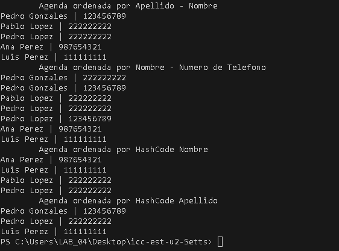

# Proyecto de Listas Enlazadas – ICC Est U2

Este repositorio contiene una implementación en Java de listas enlazadas simples, desarrollada como parte de la asignatura de Estructuras de Datos del segundo semestre de Ingeniería en Computación.

---

## 👨‍💻 Estudiante
**Daniel Duran**

---

## 📘 Descripción

El proyecto tiene como objetivo principal la creación y manipulación de listas enlazadas simples, permitiendo operaciones como inserción, eliminación, búsqueda y recorrido de elementos. Estas estructuras son fundamentales para comprender la gestión dinámica de memoria y la eficiencia en la manipulación de datos.

---

## 🛠️ Estructura del Proyecto

src/ # Archivos fuente en Java
bin/ # Archivos compilados
.vscode/ # Configuraciones para Visual Studio Code
Img Terminal.png # Imagen de ejemplo con salida del proyecto en la terminal


---

## 🚀 Requisitos

- Java 11 o superior
- Visual Studio Code con extensión Java instalada

---

## 📥 Instalación

Clona este repositorio en tu máquina local:

```bash
git clone https://github.com/DanielAntonio8a/icc-est-u2-estructurasNolineales.git

---

## 🧾 Conclusión
Este proyecto permitió comprender y aplicar conceptos clave de listas enlazadas en Java, como la creación de nodos y la manipulación dinámica de memoria. Se reforzaron habilidades en programación orientada a objetos y se evidenció la utilidad de esta estructura para operaciones eficientes de inserción y eliminación. En general, fue una experiencia formativa para el desarrollo de soluciones estructuradas y escalables.